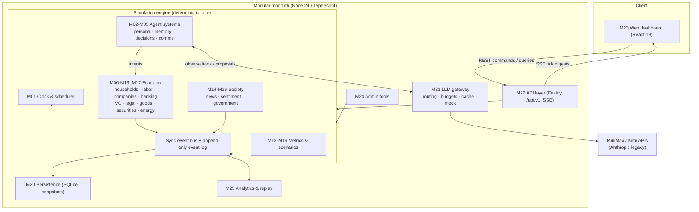
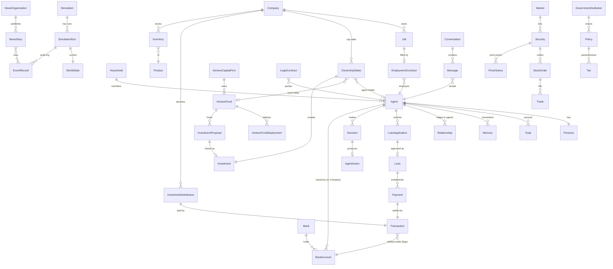
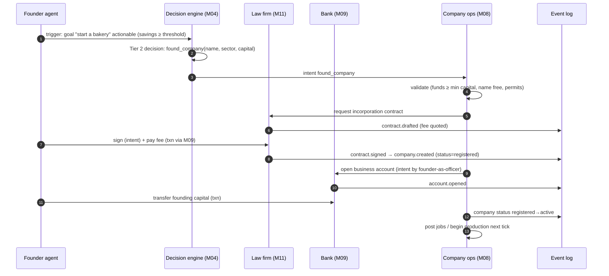
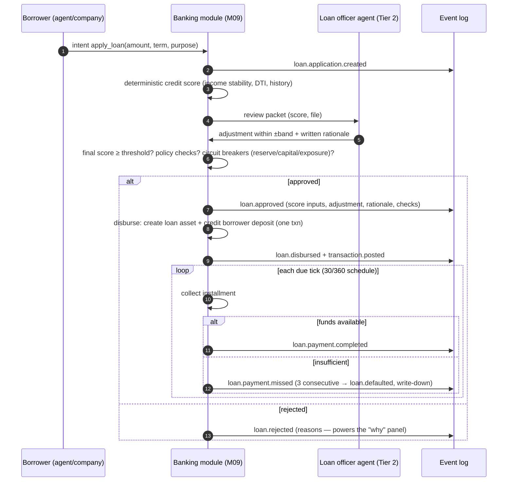
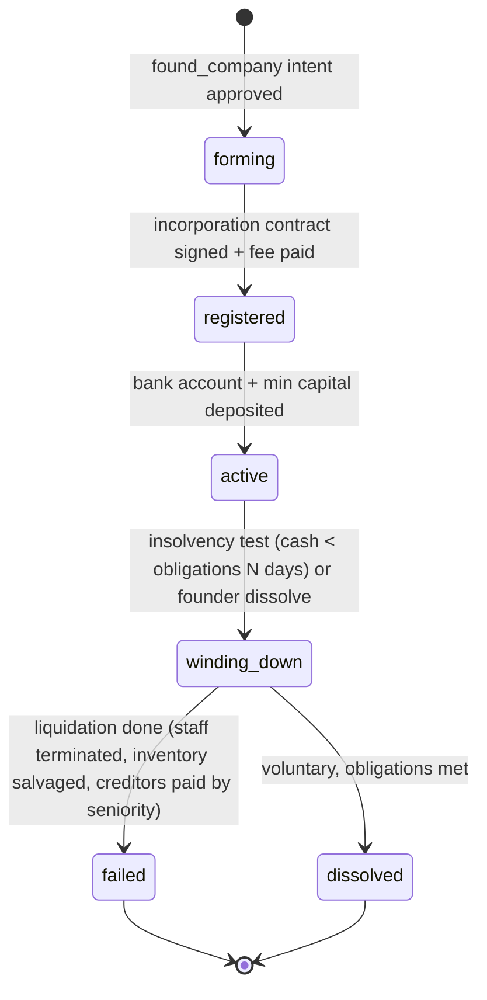
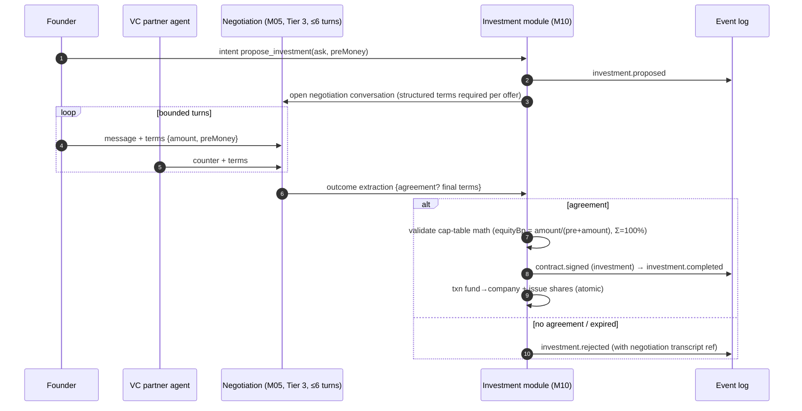
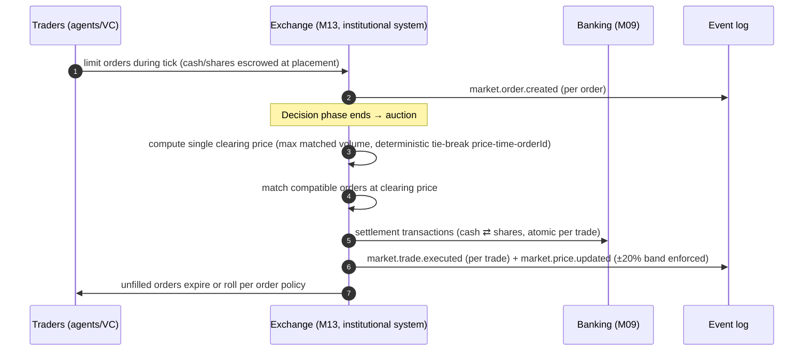
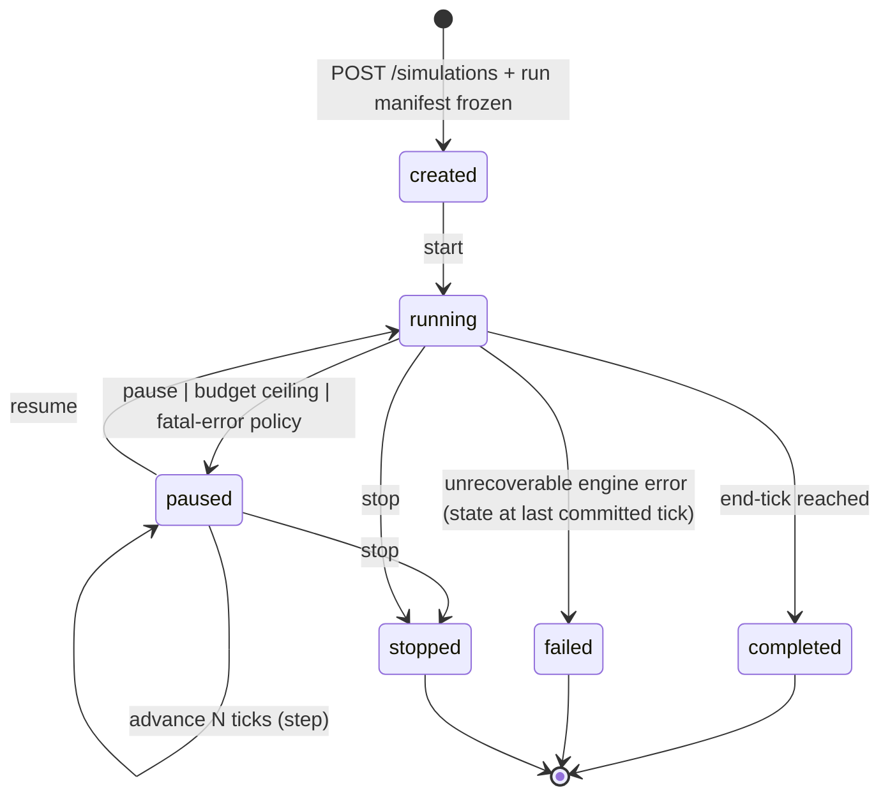

# WorldTangle — Domain Model

Companion to [PRD.md](PRD.md) and [IMPLEMENTATION_PLAN.md](IMPLEMENTATION_PLAN.md). Module IDs (M01–M26) refer to the implementation plan. Priority tags `[MVP] [V1] [LATER]` match the PRD.

**Conventions**

- IDs: typed prefixes + per-run monotonic sequence in the format `{prefix}_{base36 seq}` — e.g. `agt_00000012`, `txn_000004f2` (ADR-0008). No UUIDs inside the engine.
- Money: integer cents (`bigint`), JSON-serialized as strings. Rates: fixed-point basis points (1 bp = 0.01%).
- Time: `tick` (int), `simDate` (`Y####-M##-D##`, 360-day calendar).
- Every mutable entity carries `simulationRunId`; scenario/world-spec definitions are immutable and shared.
- **Ownership boundary** = the single module allowed to write the entity. Everyone else reads through that module's interface. Free-text fields (rationale, messages, stories, memories) are data — never parsed for control flow.

---

## 1. High-level system architecture

The LLM gateway is the **only** path to a model; the engine core (`M01–M19`) is pure and deterministic. All state changes flow through a single `apply()` choke point that commits state + events atomically (ADR-0003).

## 2. Main domain relationships (core subset)

---

## 3. Entity catalog

### 3.1 Simulation & world (owners: M01, M19, M18, M20)

#### Simulation `sim_`
- **Purpose:** A configured scenario — the unit users create and manage. Owns no world state itself.
- **Fields:** `id`, `name`, `scenarioConfig` (world-spec ref, policy set, ROW prices, budgets, llm routing table), `scenarioVersion`, `createdAt`, `status`.
- **Relationships:** 1→n SimulationRun.
- **States:** `created → active → archived` (active = has runs; archive is soft-delete).
- **Validation:** scenario config validates against the versioned scenario JSON Schema; budgets > 0; world-spec exists.
- **Owner:** M24 (admin) via M20.

#### SimulationRun `run_`
- **Purpose:** One execution of a scenario with a specific seed and pinned versions. All mutable world data hangs off a run.
- **Fields:** `id`, `simulationId`, `seed`, `runManifest` (immutable: seed, engineVersion, rulesetVersion, promptPackVersion, model routing, scenario snapshot, schema versions), `status`, `currentTick`, `startedAt`, `endedAt`, `llmMode` (`off|mock|live`), `spend` (tokens, estimated cost).
- **Relationships:** 1→1 WorldState (current), 1→n EventRecord, 1→n Snapshot.
- **States:** `created → running ⇄ paused → completed | failed | stopped` (see diagram §4.7; every transition journaled as `admin.command.received` + lifecycle event).
- **Validation:** manifest write-once; `currentTick` strictly increasing; no state mutation unless `running` or executing an `advance` while paused.
- **Owner:** M01.

#### WorldState *(aggregate view, not a table)*
- **Purpose:** The authoritative mutable state of a run — the union of all entity tables for that run plus derived caches (balances, indicator latest values). Exists as a concept for snapshots/hashing.
- **Fields:** `runId`, `tick`, `stateHash` (canonical hash over ordered entity sets, computed periodically).
- **Validation:** hash recomputation must match stored `simulation.statehash.computed` events (replay divergence detector).
- **Owner:** M20 (snapshot/hash machinery); content owned by respective modules.

#### WorldEvent `wev_`
- **Purpose:** An exogenous shock (admin-injected or scenario-scheduled) — energy price shock, demand shift, disaster stub.
- **Fields:** `id`, `runId`, `type` (from approved catalog), `params`, `source` (`admin|scenario`), `scheduledTick`, `appliedTick?`, `status`.
- **States:** `scheduled → applied | cancelled`.
- **Validation:** type must be in the approved catalog; params validate per-type schema; apply only at tick boundary.
- **Owner:** M19.

#### EconomicIndicator `ind_`
- **Purpose:** A named time series computed per tick (GDP proxy, unemploymentRate, cpi, averageWage, m1, creditOutstanding, defaultRate, businessCount, treasuryBalance, sentimentIndex).
- **Fields:** `runId`, `series`, `tick`, `value` (integer fixed-point), `formulaVersion`, `inputsDigest` (canonical hash of the exact ordered aggregates that fed it).
- **Validation:** one append-only row per series/tick; the ten-row metrics batch is atomic. Ruleset v1 includes all FR-OBS-2 series and publishes the same values/version/digests in `economic.metrics.updated`. Migration-28 legacy rows remain explicitly version 0 with an all-zero digest rather than claiming reconstructed provenance. M1 v1 is agent/company checking deposits. The WS-508 M26 sweep reconstructs every M1 and treasury point from ledger legs and proves `M1 Δ = authorized domestic-supply Δ − treasury Δ`; mint, lending, repayment and ROW effects require matching transaction events and residual cents must equal zero. See [WS-704 formulas and evidence](WS_704_FULL_INDICATORS.md).
- **Owner:** M18.

### 3.2 Agents & social fabric (owners: M02, M03)

#### Agent `agt_`
- **Purpose:** A simulated person — the actor unit. (Institutions are NOT agents.)
- **Fields:** `id`, `runId`, `personaId`, `householdId`, `occupationCode`, `employmentStatus` (`employed|unemployed|student|retired|homemaker`), `creditScore` (300–850), `quarantine` (`none|tier1_only` + until tick), `aliveFlags`.
- **Relationships:** 1→1 Persona; n→1 Household; 1→n Goal/Memory/Relationship/Decision; accounts via M09; jobs via M07.
- **Validation:** occupation ∈ catalog; employmentStatus consistent with active EmploymentContract (INV-5).
- **Owner:** M02 (identity), state fields by the module that governs them (e.g. employmentStatus by M07).

#### Persona
- **Purpose:** The mostly-immutable identity card used to build every prompt for this agent.
- **Fields:** `agentId`, `name` (synthetic), `age`, `gender?`, `education` (`none|hs|college|graduate`), `skills` (map skillCode→0–100), `personality` (Big Five 0–100 + riskTolerance, timePreference, ambition 0–100), `bioSummary` (generated once), `promptVersion`.
- **Validation:** generated by INITIAL_WORLD templates; all traits in range; name uniqueness per run; blocklist check (SAF-2).
- **Owner:** M02. Immutable after world-gen except `bioSummary` regeneration on prompt-pack upgrade (journaled).

#### Occupation *(catalog, immutable)*
- **Fields:** `code`, `title`, `requiredSkills`, `baseWageBand` (min/max cents/year), `sector`.
- **Owner:** M02 (definition), referenced by M07.

#### Skill *(catalog, immutable)*
- **Fields:** `code`, `name`, `sector affinity`. Agent skill levels live on Persona. Skill progression [LATER].
- **Owner:** M02.

#### Goal `gol_`
- **Purpose:** A persistent aspiration that generates triggers when actionable ("save $5,000", "start a bakery", "get a better job").
- **Fields:** `id`, `agentId`, `kind`, `params` (target amount, sector…), `priority` (1–5), `status`, `activationRule` (predicate ref), `progress`.
- **States:** `dormant → active → achieved | abandoned` (abandon via decision or infeasibility rule).
- **Validation:** ≤ `maxActiveGoals` (default 3) active per agent; params schema per kind.
- **Owner:** M02 (definition) / M04 (status transitions).

#### Need *(catalog + per-agent levels)*
- **Purpose:** Drives Tier-0 consumption and financial-stress triggers: `food, housing, utilities, healthcare, social, security(buffer)`.
- **Fields:** per agent: `needCode`, `satisfaction` (0–100), `subsistenceCostRef`.
- **Validation:** satisfaction updated only by deterministic consumption/outcome rules.
- **Owner:** M06.

#### Opinion (incl. Belief)
- **Purpose:** Positions on the four opinion axes (redistribution, regulation, institutionalTrust, economicOptimism) plus topical beliefs (keyed claims with confidence) that news/conversations can shift.
- **Fields:** immutable seed value plus append-only `{id, agentId, axis, tick, previousValue, delta, value, causeStoryIds, causeContributionIds, sourceSentimentUpdateIds, sourceEventId}` updates.
- **Validation:** |Δ per complete tick| ≤ 5; value remains −100..100; every change carries foreign-keyed story, contribution, sentiment-update, and event causes (FR-AGT-8).
- **Owner:** M15.

#### Memory `mem_`
- **Purpose:** Append-only salient records feeding decision context; the only free text an LLM writes about itself.
- **Fields:** `id`, `agentId`, `tick`, `kind` (`event|conversation|outcome|reflection`), `content` (bounded length), `importance` (0–100, rule-scored), `references` (eventIds), `compactedInto?`.
- **Validation:** per-agent count bound with deterministic compaction (oldest low-importance summarized); content is untrusted data (SAF-3).
- **Owner:** M03.

#### Relationship `rel_`
- **Purpose:** Typed social edge used for conversation partner selection, trust weighting, news relay.
- **Fields:** `id`, `runId`, `fromAgentId`, `toAgentId`, `type` (`family|friend|colleague|business|adversary`), `strength` (−100..100), `lastInteractionTick`.
- **Validation:** no self-edges; strength delta per event bounded; symmetric edges stored as two directed rows (allows asymmetry).
- **Owner:** M02 (creation at world-gen) / M05 (strength updates).

#### Household `hh_`
- **Purpose:** Consumption/budget unit; shares subsistence costs and pooled buffer rules.
- **Fields:** `id`, `runId`, `memberAgentIds`, `structure` (`single|couple|family|shared`), `housingTier` (rent level), `budgetPolicy` (buffer days, discretionary propensity).
- **Validation:** every person-agent belongs to exactly one household; rent tier from world spec.
- **Owner:** M06.

### 3.3 Employment (owner: M07)

#### Employer *(role concept, not a table)*
Any `Company` or `Institution` that may post Jobs. Implemented as a capability flag; listed here because the brief names it.

#### Job `job_`
- **Purpose:** A posted position.
- **Fields:** `id`, `runId`, `employerId`, `occupationCode`, `title`, `wage` (cents/year), `requirements` (skill minima), `openings`, `status`, `postedTick`.
- **States:** `open → filled | withdrawn | expired`.
- **Validation:** wage ≥ minimum wage policy; employer solvent enough for 1 payroll cycle at posting (soft check → warning event).
- **Owner:** M07.

#### EmploymentContract `emp_`
- **Purpose:** The binding agreement behind every employment relation (INV-5). A specialization of LegalContract semantics kept in its own table for hot-path payroll queries.
- **Fields:** `id`, `runId`, `jobId`, `employerId`, `employeeAgentId`, `wage`, `startTick`, `endTick?`, `noticeTicks`, `status`, `legalContractId`.
- **States:** `signed → active → terminated(reason: quit|layoff|company_failure|fired)`.
- **Validation:** one active contract per agent (MVP single job); wage immutable except via amendment (new record, V1); termination emits `employment.terminated` with reason.
- **Owner:** M07.

### 3.4 Companies & production (owner: M08, M12)

#### Company `co_`
- **Purpose:** A business: production, sales, employment, accounts, cap table.
- **Fields:** `id`, `runId`, `name`, `sector`, `foundedTick`, `founderAgentId`, `status`, `productCatalog` (offerings + posted prices), `capacity`, `productivity`, `registeredContractId`, `failureCause?`.
- **Relationships:** 1→n Job/EmploymentContract/Inventory/OwnershipStake; 1→n BankAccount (via M09); products.
- **States:** `forming → registered → active → winding_down → failed | dissolved` (see §4.3).
- **Validation:** cannot hire/trade until `active` (requires: registration contract signed + bank account + min capital); `failed` requires the FR-CO-4 wind-down to complete.
- **Owner:** M08.

#### CompanyDepartment `dep_` [V1]
- **Purpose:** Sub-structure for larger firms (production, sales, admin) enabling role scoping. MVP: implicit single department.
- **Fields:** `id`, `companyId`, `kind`, `managerAgentId?`, `headcountBudget`.
- **Owner:** M08.

#### Product / Service *(catalog + company offerings)*
- **Purpose:** What can be produced/sold. `kind: good|service` (Service = Product with `inventoried=false`).
- **Fields:** catalog: `sku`, `name`, `kind`, `unit`, `basketWeight` (CPI), `rowRefPrice`; offering: `companyId`, `sku`, `postedPrice`, `unitCost` (derived), `active`.
- **Validation:** postedPrice ≥ 1 cent; catalog immutable per ruleset version.
- **Owner:** M12 (catalog), M08 (offerings/prices).

#### Inventory `invt_`
- **Purpose:** Stock of a good at a company.
- **Fields:** `companyId`, `sku`, `quantity`, `avgUnitCost` (moving average, cents fixed-point).
- **Validation:** quantity ≥ 0 always (INV via validation before sale); services never inventoried.
- **Owner:** M08 (mutations via production/sales handlers).

#### Order (goods) `gord_`
- **Purpose:** A purchase order in the consumer/wholesale market (posted-price market → orders always fill or reject immediately in MVP).
- **Fields:** `id`, `runId`, `buyerId` (agent|company), `sellerId`, `sku`, `quantity`, `unitPrice`, `status`, `tick`.
- **States:** `placed → filled | rejected(reason: stockout|insufficient_funds)`.
- **Validation:** buyer funds check at placement; seller inventory check; both re-checked at settlement.
- **Owner:** M12.

### 3.5 Banking & money (owner: M09; transactions are the financial source of truth)

#### Bank `bank_`
- **Purpose:** Deposit-taking, lending institution with its own internal ledger.
- **Fields:** `id`, `runId`, `name`, opening `capital` (cents), fixed `reserveCents`, `reserveRatioMinBp`, `capitalRatioMinBp`, `baseLendingRateBp`, `exposureCapPerBorrower`, `status`, plus derived current deposits, loans, effective capital, reserve ratio, and capital ratio.
- **Validation:** circuit breakers (FR-BNK-6) evaluate the post-credit deposit denominator before approval and again before disbursement. Systemic reserve/capital breaches halt the bank; per-borrower exposure blocks only that borrower. Effective capital is opening capital plus bank income less booked bank expense, floored at zero. The public trailing 30-tick income statement is a read projection over exact debit legs on the bank's interest-income and credit-loss accounts, constrained to the corresponding immutable transaction reasons.
- **Owner:** M09.

#### BankAccount `acct_`
- **Purpose:** A deposit account (personal, business, treasury, or internal bank book account).
- **Fields:** `id`, `runId`, `bankId`, `ownerKind` (`agent|company|government|bank_internal|system_row`), `ownerId`, `type` (`checking|internal_asset|internal_liability|internal_income|internal_expense|equity`), `balance` (cached, cents), `floor` (default 0), `status`, `openedTick`.
- **Validation:** balance = Σ postings (checked by invariant job); no posting may take balance below `floor` unless account type allows (credit) — INV-3; ownership immutable.
- **Owner:** M09.

#### Transaction `txn_`
- **Purpose:** THE atomic, balanced, immutable money movement — double-entry with ≥2 legs.
- **Fields:** `id`, `runId`, `tick`, `legs[] {accountId, direction(debit|credit), amount}`, `kind` (`payroll|purchase|loan_disbursement|loan_payment|tax|transfer|fee|dividend|mint|row_settlement…`), `actor`, `reason`, `sourceEventId`, `correlationId`, `idempotencyKey`.
- **Validation:** Σdebits = Σcredits exactly (INV-1); every leg's account exists and permits the posting; `idempotencyKey` unique (duplicate-protection); immutable once committed; kind∈catalog. Money creation kinds (`mint|loan_disbursement|row_settlement`) restricted to authorized system actors (INV-2).
- **Owner:** M09 (the ONLY module that writes transactions; all others request postings through its interface).

#### SeedLoan `loan_` (opening world state)
- **Purpose:** A seasoned pre-simulation business or personal loan whose history affects opening bank assets and later underwriting evidence.
- **Fields:** `id`, `runId`, borrower, purpose, original/outstanding principal cents, annual rate basis points, term and seasoned months, current/delinquent status, missed-payment count, and the complete ordered `{installment,principalCents,interestCents,status}` history. An immutable link identifies its bank asset, borrower checking account, and two-leg opening-recognition transaction.
- **Validation:** Riverbend has exactly Ironvale's current 36-month loan at month 22, six current personal loans, and one distinct personal loan one payment behind. Equal-principal rows sum exactly; interest recomputes with monthly 30/360 HALF_EVEN arithmetic; non-paid principal equals the bank asset and declared outstanding balance. Each link joins the correct same-bank accounts and recognition legs, and one versioned `loan.seeded` event follows the matching `transaction.posted` event. Migration v17 rejects inconsistent inserts and prevents update/delete. The complete audit is part of INV-6.
- **Owner:** M02 generation; M09 persistence and audit.

#### LoanApplication `loanapp_`
- **Purpose:** A request for credit with its full underwriting record — powers the "why" panel.
- **Fields:** immutable request core `id`, `runId`, `applicantKind`, `applicantId`, `bankId`, `purpose`, `amountCents`, `termMonths`, `submittedTick`, `sourceEventId`; mutable workflow state `status`, `decidedTick?`. The immutable score record is a separate `CreditScoreAssessment`.
- **States:** `submitted → under_review → approved | rejected | withdrawn`.
- **Validation:** officerAdjustment within configured band; approval requires finalScore ≥ threshold AND all policy checks pass AND bank circuit breakers clear; decision immutable once made.
- **Owner:** M09.

#### CreditScoreAssessment `cscore_`
- **Purpose:** The immutable, versioned underwriting snapshot computed when an application is submitted.
- **Fields:** `id`, `runId`, `applicationId`, `modelVersion`, exact `inputs` (income, debt service, debt, request, stability/DTI/history basis points, observations, no-history flag, evidence references), `systemScore`, additive component `breakdown`, `computedTick`, `sourceEventId`.
- **Validation:** model v1 is integer-only and bounded to 300–850; stored DTI/history derivations must recompute exactly; one assessment per application; score equals the component sum.
- **Owner:** M09.

#### LoanApplicationReview `loanrev_` and LoanApplicationDecision `loandec_`
- **Purpose:** An immutable officer assignment followed by the complete stored why-record for one terminal underwriting result.
- **Review fields:** `id`, `runId`, `applicationId`, `officerAgentId`, `reviewTier`, `startedTick`, `sourceEventId`.
- **Decision fields:** application/score/review references, officer and tier, policy version, system score, bounded adjustment, final score, written rationale, six ordered checks with evidence, outcome, offered rate (approval only), decision tick, and source event.
- **Validation:** Tier 1 adjustment is exactly zero; the officer must be active in the bank role; every policy check appears once; outcome exactly equals the conjunction of checks; only approval has a rate; application, assessment, review, officer, and decision references must agree; all terminal records are immutable.
- **Owner:** M09.

#### BankLendingAssessment `bca_`
- **Purpose:** Immutable proof that reserve, capital, bank-status, and per-borrower exposure gates were evaluated from authoritative state before an approval or disbursement.
- **Fields:** `id`, `runId`, `bankId`, `applicationId`, nullable `decisionId`, `stage`, borrower, tick, policy version, before/after bank status, current/projected deposits, fixed reserves, current/projected reserve ratio and minimum, effective capital, current/projected capital ratio and minimum, current/projected borrower exposure and cap, request amount, pass flags, ordered failures, `allowed`, and `sourceEventId`.
- **Validation:** projected deposits and exposure equal current plus request exactly; integer ratios floor deterministically; pass flags and status transition recompute exactly; inputs match the application, bank, accounts, income/loss books, and loan books; approval decisions and originated loans require the corresponding assessment; immutable and undeletable.
- **Owner:** M09.

#### Loan `loan_`
- **Purpose:** An approved, disbursed credit with its amortization schedule.
- **Fields:** `id`, `runId`, `applicationId`, `decisionId`, `borrowerKind`, `borrowerId`, `bankId`, `principalCents`, `annualRateBp`, `termMonths`, `disbursedTick`, `maturityTick`, `outstandingPrincipalCents`, `consecutiveMisses`, `status`, `bankAssetAccountId`, `borrowerDepositAccountId`, `disbursementTransactionId`, `scheduleDigest`, `sourceEventId`. Immutable `loan_installments` rows hold `{id,installmentNumber,dueTick,openingPrincipalCents,principalDueCents,interestDueCents,totalDueCents,status,paidTick?,transactionId?,sourceEventId}`.
- **States:** `approved → disbursed → repaying → paid_off | defaulted (→ written_off | collected)`.
- **Validation:** The schedule uses equal principal and exact 30/360 periods. Rows 1..N−1 use `floor(principal/N)`, the last row absorbs all principal residue, and each row's interest is `openingPrincipal × annualRateBp × 30 / (10,000 × 360)` rounded to cents with canonical HALF_EVEN. Therefore Σ schedule principal equals principal exactly. A fresh allowed disbursement-stage circuit assessment is mandatory before the internal bank asset, borrower deposit, balanced system-authorized lending transaction, loan, installments, and causal events can commit atomically (INV-6); their approved terms and ledger references must agree and remain immutable. A collection requires the complete ordered arrears set, reduces outstanding principal by exactly the completed principal rows, and resets consecutive misses. Default only follows three consecutive due-date misses; restructuring [V1] creates a new loan.
- **Owner:** M09.

#### Payment `pay_`
- **Purpose:** One installment attempt against a loan.
- **Fields:** `id`, `loanId`, `installmentNumber`, `dueTick`, `openingPrincipalCents`, `principalDueCents`, `interestDueCents`, `totalDueCents`, `paidTick?`, `transactionId?`, `status` (`due|completed|missed`), `sourceEventId`.
- **Validation:** completed ⇔ a matching system `loan_payment` transaction exists with exact borrower, loan-asset, loan-source, and optional interest-income legs. A missed row may later become completed only as part of a fully funded arrears set. Partial payments are not allowed in MVP (all-or-miss).
- **Owner:** M09.

#### LoanDefaultRecord `ldef_`
- **Purpose:** Immutable proof that the three-miss threshold, bank loss booking, borrower flag, and score consequence committed together.
- **Fields:** `id`, `runId`, `loanId`, `borrowerKind`, `borrowerId`, `bankId`, `defaultTick`, `outstandingPrincipalCents`, ordered `missedInstallmentIds`, `writeDownTransactionId`, nullable before/after scores, `creditScorePenaltyPoints`, `sourceEventId`.
- **Validation:** the linked loan is `defaulted` with at least three misses; the linked system transaction credits the remaining loan asset and debits the bank's dedicated internal expense account for the same cents; agent defaults apply exactly 100 points with a 300 floor, while company defaults never mutate an agent score; immutable and undeletable.
- **Owner:** M09.

#### Credit read model and indicators
- **Purpose:** Present UC-4 from authoritative stored records without creating a second credit truth.
- **Fields:** a normalized loan list projection over `seed_loans` and originated `loans`; a discriminated detail projection (`opening_seed | underwritten`); persisted `creditOutstanding` cents and `defaultRate` basis-point series.
- **Validation:** the feed is deterministically ordered by opening tick then ID and uses run-bound opaque cursors. Opening why-panels expose only stored recognition/schedule/event provenance. Underwritten panels join the exact application, score assessment, review, decision, circuit assessments, schedule and optional default. `creditOutstanding` sums gross contractual outstanding principal; `defaultRate = HALF_EVEN(default records × 10,000 / all loans)`. Migration v18 extends the immutable indicator key constraint, and the existing logical hash includes every indicator point.
- **Owner:** M18 computes/persists indicators; M22 projects stored reads; M23 renders them.

### 3.6 Investment & VC (owner: M10) [V1]

#### VentureCapitalFirm `inst_`
- **Fields:** `id`, `runId`, `name`, `status` (`active|closed`), `createdTick`, `sourceEventId`. Riverbend partner authority is resolved from employed institution roles rather than copied into the firm row.
- **Validation:** run-scoped institution identity; immutable creation fact; only authorized active partners may negotiate for the firm.
- **Owner:** M10.

#### VentureFund `vfund_` and VentureFundDeployment `vdep_`
- **Fund fields:** `id`, `runId`, `firmId`, dedicated `bankAccountId`, `name`, `fundSizeCents`, `deployedCents`, `status` (`open|fully_deployed|closed`), `createdTick`, `sourceEventId`.
- **Deployment fields:** `id`, `runId`, `fundId`, `targetCompanyId`, `referenceId`, `amountCents`, `deployedBeforeCents`, `deployedAfterCents`, `deployedTick`, `sourceEventId`.
- **Validation:** all cents are canonical signed-64-bit integer text; `0 ≤ deployedCents ≤ fundSizeCents`; deployment rows form an immutable exact-addition chain; exact exhaustion sets `fully_deployed`; investment cash moves only through the fund's dedicated account.
- **Owner:** M10.

#### InvestmentProposal `prop_`
- **Purpose:** A pitch + negotiation record.
- **Fields:** `id`, `runId`, `companyId`, `founderAgentId`, `firmId`, `fundId`, `vcPartnerAgentId`, `askAmountCents`, `preMoneyValuationCents`, `initialEquityBasisPoints`, `status`, nullable `negotiationConversationId`, nullable exact `finalTerms`, `proposedTick`, `expiresTick`, `sourceEventId`, `lastTransitionEventId`.
- **States:** `proposed → negotiating → agreed → completed | rejected | expired`.
- **Validation:** founder and partner are distinct and authorized; the open fund can cover the bounded ask; `expiresTick > proposedTick`; terms recompute `round(amount × 10,000 / (preMoney + amount))` within one basis point; terminal transitions preserve exact causal evidence.
- **Owner:** M10.

#### Investment `inv_`
- **Purpose:** A closed financing: money in, shares issued.
- **Fields:** `id`, `runId`, `proposalId`, `companyId`, `investorId` (venture fund), `firmId`, `amountCents`, `preMoneyValuationCents`, `sharesIssued`, `totalSharesBefore`, `totalSharesAfter`, `pricePerShareCents`, `transactionId`, nullable `capitalCallTransactionId`, `contractId`, `ownershipStakeId`, `completedTick`, `sourceEventId`.
- **Validation:** exact integer price identities (`price × prior shares = pre-money`, `price × issued shares = amount`, `prior + issued = after`); one atomic contract, cash transfer, fund deployment, stake, cap-table revision, proposal transition, and completion event; INV-4 remains exact.
- **Owner:** M10.

#### OwnershipStake `stk_`
- **Purpose:** Cap-table entry (also used for founder equity from day 1 — MVP).
- **Fields:** `id`, `runId`, `companyId`, `holderKind` (`agent|venture_fund`), `holderId`, `shares` (positive integer text), `acquiredVia` (`founding|investment|trade`), `sinceTick`, nullable `sourceEventId`.
- **Validation:** Σ shares per company equals the authoritative cap-table total exactly (INV-4); founding stakes belong to agents; investment stakes belong to venture funds; transfers/issuances are atomic.
- **Owner:** M10 (M08 writes the founding stake at creation via M10's interface).

#### InvestmentDistribution `dist_`
- **Purpose:** Immutable historical dividend declaration and exact owner allocation.
- **Fields:** `id`, `companyId`, `amountCents`, `totalShares`, `companyAccountId`, `transactionId`, `referenceId`, `distributedTick`, `allocations[] {holderKind, holderId, shares, amountCents, accountId}`, `requestEventId`, `sourceEventId`.
- **Validation:** current stakes are aggregated per beneficial owner and sorted canonically before largest-remainder allocation; allocation shares equal the cap table and allocation cents equal the declared amount exactly; one balanced domestic dividend transaction matches every positive allocation; zero-cent allocations remain auditable without zero-value ledger legs.
- **Owner:** M10; M09 owns the linked transaction.

### 3.7 Legal (owner: M11)

#### LegalContract `ctr_`
- **Purpose:** Generic enforceable agreement: `incorporation | employment | loan | service | lease | investment`.
- **Fields:** `id`, `runId`, `type`, `parties[] {id, role, signedTick?}`, `terms` (typed per contract type, machine-readable), `obligations[] {dueTick|recurrence, kind, params, status}`, `draftedBy` (lawFirmId?), `fee`, `status`, `breachRecords[]`.
- **States:** `draft → signed → active → completed | terminated | breached` (signed requires ALL parties; active at effective tick).
- **Validation:** terms schema per type; obligations enforced by scheduler (they FIRE — contracts are executable); breach detected by deterministic predicates; termination honors notice rules.
- **Owner:** M11. (EmploymentContract and Loan keep hot-path copies; M11 holds the legal record — the `legalContractId` links them.)

### 3.8 Markets & securities (owner: M13) [V1]

#### Market `mkt_`
- **Fields:** `id`, `runId`, `kind` (`securities|goods_reference`), `operatorInstitutionId`, `auctionSchedule` (per tick), `priceBandBp` (±2000 = ±20%/day), `status`.
- **Owner:** M13 (securities), M12 (goods reference prices).

#### Security `sec_`
- **Fields:** `id`, `runId`, `companyId`, `symbol`, `sharesListed`, `listedTick`, `status` (`listed|suspended|delisted`).
- **Validation:** listing requires eligibility rules (age, profitability or capital minima); shares listed ≤ company totalShares.
- **Owner:** M13.

#### StockOrder `ord_`
- **Fields:** `id`, `runId`, `securityId`, `side` (`buy|sell`), `ownerId`, `limitPrice`, `quantity`, `escrowRef` (cash or shares locked at placement), `status`, `placedTick`.
- **States:** `open → filled | partially_filled → filled | cancelled | expired`.
- **Validation:** funded at placement (escrow, INV: no naked orders); price within band; integer share quantities.
- **Owner:** M13.

#### Trade `trd_`
- **Fields:** `id`, `runId`, `securityId`, `buyOrderId`, `sellOrderId`, `price` (clearing), `quantity`, `tick`, `settlementTransactionId`.
- **Validation:** exists only from compatible orders at the auction clearing price (INV-7); settlement atomic (cash ⇄ shares).
- **Owner:** M13.

#### PriceHistory
- **Fields:** `securityId|sku`, `tick`, `price`, `volume?`, `source` (`auction|rule|decision`).
- **Validation:** append-only.
- **Owner:** M13 (securities), M12 (goods).

### 3.9 News & sentiment (owners: M14, M15)

#### NewsOrganization `norg_`
- **Fields:** `id`, `runId`, `name`, `editorAgentId`, `journalistAgentIds`, `dailyStoryCap`, `stanceBias` (−2..2, editorial slant).
- **Owner:** M14.

#### NewsStory `sty_`
- **Purpose:** A published article; the only LLM long-form output that reaches other agents.
- **Fields:** `id`, `runId`, `orgId`, `authorAgentId`, `tick`, `headline`, `body` (bounded), `topic` (catalog), `stance` (−2..2), `citedEventIds[]` (≥1, must exist), `entities[]`, `reach` (computed), `status`.
- **States:** `draft → published | spiked` (schema-invalid or over-cap → spiked, logged, never published).
- **Validation:** cited events must exist and be ≤N ticks old; fact fields (amounts, names) copied from events, not LLM-generated; content-category filter (SAF-6).
- **Owner:** M14.

#### SentimentIndex *(per topic)*
- **Fields:** `id`, `runId`, `topic` (`economy|employment|institutions`; market stories route to economy), `tick`, `previousValue`, `decayedValue`, `storyDelta`, `value` (−10,000..10,000), `contributingStoryIds`, `contributionIds`, `sourceEventId`.
- **Validation:** integer 0.5% decay; ≤2,000 points/story, ≤2,500 points/topic/tick, bounded index; every stance/reach/outcome delta is an immutable attributed contribution.
- **Owner:** M15.

### 3.10 Government & politics (owner: M16)

#### GovernmentInstitution `gov_`
- **Fields:** `id`, `runId`, `name`, `treasuryAccountId`, `officeholders {mayor, treasurer, …}`, `employeeAgentIds`.
- **Owner:** M16.

#### Policy `pol_`
- **Purpose:** A named lever with versioned values: `income_tax_rate_bp`, `corporate_tax_rate_bp`, `unemployment_benefit_cents`, `minimum_wage_cents`, `base_rate_bp` [V1].
- **Fields:** `id`, `runId`, `key`, `value`, `effectiveTick`, `source` (`world_gen|admin|scenario|gov_decision[V1]`), `previousValue`, `causeEventId`.
- **Validation:** value within per-key legal range; changes apply only at tick boundaries; history append-only.
- **Owner:** M16.

#### Tax *(assessment records)*
- **Fields:** `id`, `runId`, `kind` (`income_withholding|corporate`), `payerId`, `periodRef`, `base`, `rateBp`, `amount`, `transactionId`, `tick`.
- **Validation:** amount = mulDiv(base, rateBp, 10000, HALF_EVEN); every assessment settles via transaction to treasury (`tax.collected`).
- **Owner:** M16.

#### PoliticalGroup `pgrp_` [LATER] / Election `ele_` [LATER]
- **Purpose:** Reserved designs. Election: `{id, officeKey, candidateAgentIds, scheduleTicks, tally, status: scheduled→campaigning→voting→certified}`. PoliticalGroup: `{id, name, platform (opinion-axis vector), memberAgentIds}`.
- **Validation (design):** one vote per eligible agent; deterministic tally; campaign effects only through news/conversation channels.
- **Owner:** M16. **Not built before LATER (PRD FR-GOV-4).**

### 3.11 Interaction & cognition (owners: M04, M05)

#### Conversation `cnv_`
- **Fields:** `id`, `runId`, `participantAgentIds`, `topic`, `initiatingTrigger` (eventId), `maxTurns` (≤6 MVP), `tokenBudget`, `status`, `outcome? {kind: agreement|no_agreement|escalate, structuredTerms?}`, `startTick`, `endTick?`.
- **States:** `active → concluded | expired | force_closed(no_progress)`.
- **Validation:** turn/budget caps hard-enforced; no-progress detector (identical structured terms twice → force close); outcome extraction mandatory at close.
- **Owner:** M05.

#### Message `msg_`
- **Fields:** `id`, `conversationId`, `senderAgentId`, `turn`, `content` (bounded text, untrusted data), `structuredTerms?` (typed offer terms — the only binding part), `tick`.
- **Validation:** sender ∈ participants; turn ordering strict; structuredTerms schema per negotiation kind.
- **Owner:** M05.

#### Decision `dec_`
- **Purpose:** The explainability record for every Tier ≥1 choice.
- **Fields:** `id`, `runId`, `agentId`, `tick`, `trigger` (kind + sourceEventId), `tier` (1|2|3), `observationDigest` (hash + stored summary), `optionsOffered[]`, `chosenActionId?`, `params?`, `rationale` (rule name or LLM text), `llmCallId?`, `validationResult` (`approved|rejected(code)`), `promptPackKey?`, `promptVersion?`, `promptHash?`. The four LLM/prompt fields are mandatory together for Tier 2/3 and forbidden for Tier 1.
- **Validation:** immutable; every Tier 2/3 decision links an LlmCallRecord; chosen action type and canonical parameters must exactly match one `optionsOffered` entry. A provider attempt whose proposal fails this check produces a Tier-1 Decision plus a `validation_failed` LlmCallRecord linked back by `decisionId`.
- **Owner:** M04.

#### AgentAction `act_`
- **Purpose:** An approved intent in execution — the bridge from decision to state change.
- **Fields:** `id`, `runId`, `decisionId?` (Tier 0 actions may omit), `actorId`, `type` (action catalog: `apply_for_job|post_job|hire|quit|found_company|open_account|apply_loan|purchase|set_price|send_message|publish_story|…`), `params`, `status`, `resultEventIds[]`.
- **States:** `validated → applied | failed(engine_error)` (rejected intents never become actions; they live on the Decision).
- **Validation:** type ∈ catalog; params schema per type; capability check against actor (INV-10).
- **Owner:** M04 (creation), executing module (status).

### 3.12 Audit & platform (owners: M20, M21, M25)

#### EventRecord (AuditLog) `evt_`
- **Purpose:** THE append-only audit log — every state change and lifecycle fact, in the versioned envelope (API_CONTRACTS §4).
- **Fields:** `eventId`, `type`, `schemaVersion`, `simulationId`, `runId`, `seq` (per-run monotonic), `tick`, `simDate`, `wallTime`, `actor {kind: agent|institution|system|admin, id}`, `correlationId`, `causationId?`, `payload` (typed per event).
- **Validation:** append-only (no UPDATE/DELETE at the store level); seq gapless per run; payload validates against the event-type schema at write time.
- **Owner:** M20 (storage) / all modules publish via the bus.

#### RunManifest *(embedded in SimulationRun, listed for emphasis)*
Write-once record making runs reproducible: seed, engine/ruleset/promptPack/schema versions, model routing, scenario snapshot, world-spec hash. **Owner:** M01.

#### LlmCallRecord `llm_`
- **Fields:** `id`, `runId`, `decisionId`, `agentId`, `tick`, `moduleId`, `purpose`, `requestedTier`, `effectiveTier`, `provider`, `model`, `promptPackKey`, `promptVersion`, `promptHash`, `schemaKey`, `schemaVersion`, `requestHash`, `status` (`success|fallback`), `fallbackReason?`, `providerErrorCode?`, bounded `detail?`, `cached`, `attempts`, `inputTokens`, `cachedInputTokens`, `outputTokens`, `costMicrocents`, validated `response?`, `sourceEventId`.
- **Validation:** strict and append-only; one record per Decision/provider attempt boundary. Success requires a response and effective Tier 2/3. Fallback requires a typed reason, cannot carry an accepted response, and may retain real token/attempt usage when a schema-valid response failed action validation. The call's source event is deferred only until the enclosing tick commits. Spend aggregates reconcile with provider usage within tolerance (AC-2).
- **Owner:** M21.

#### Snapshot `snap_`
- **Fields:** `id`, `runId`, `tick`, `kind` (`sqlite_backup|logical`), `location`, `stateHash`, `createdWall`.
- **Validation:** written atomically (temp+fsync+rename); restoring must reproduce `stateHash`.
- **Owner:** M20.

---

## 4. Workflow diagrams

### 4.1 Company-formation workflow [MVP]

### 4.2 Bank-loan workflow [MVP]

### 4.3 Company lifecycle states

### 4.4 Venture-capital workflow [V1]

### 4.5 Stock-market workflow (daily call auction) [V1]

### 4.6 Simulation tick lifecycle

```mermaid
flowchart TD
    A[TickStart: obligations fire\npayroll D15/D30 · loan installments · contract obligations · scheduled tasks] --> B[Perception & triggers\ncompute wake set — no LLM for untriggered agents]
    B --> C[Decisions\nTier 0/1 rules inline · Tier 2/3 provider work at pre-tick barrier]
    C --> D[Prepare in canonical order\nsequential today · batch transport later]
    D --> E[Validate & execute intents\npermissions · funds · laws → apply&#40;&#41; choke point]
    E --> F[Market clearing\nlabor matches · goods orders · V1 call auction]
    F --> G[Settlement & accounting\nbalanced transactions post]
    G --> H[News & sentiment\nstories from event digest · sentiment indices update]
    H --> I[Metrics\nindicators recompute · economic.metrics.updated]
    I --> J[Commit\nstate + events atomic · periodic snapshot + stateHash\nsimulation.tick.completed → SSE digest]
    J -->|next tick| A
```

### 4.7 SimulationRun state machine

---

## 5. Ownership boundary summary

| Module | Writes (owns) | Never writes |
|---|---|---|
| M01 | SimulationRun, RunManifest, scheduler queue | any domain entity |
| M02 | Agent, Persona, Occupation/Skill catalogs, Relationship (gen) | balances, employment |
| M03 | Memory | anything else |
| M04 | Decision, AgentAction | world state (proposes only) |
| M05 | Conversation, Message, Relationship.strength | contracts, money |
| M06 | Household, Need levels | transactions (requests via M09) |
| M07 | Job, EmploymentContract, Agent.employmentStatus | payroll postings (requests M09) |
| M08 | Company, Inventory, offerings/prices, CompanyDepartment | cap table (via M10), transactions |
| M09 | Bank, BankAccount, **Transaction**, LoanApplication, Loan, Payment | non-financial state |
| M10 | VC firm/fund/deployment, InvestmentProposal, Investment, OwnershipStake, InvestmentDistribution | company operations |
| M11 | LegalContract | the hot-path copies (M07/M09 own theirs) |
| M12 | Product catalog, goods Orders, goods PriceHistory | inventory (M08), money (M09) |
| M13 | Market, Security, StockOrder, Trade, securities PriceHistory | cash/share settlement postings (requests M09/M10) |
| M14 | NewsOrganization, NewsStory | sentiment values |
| M15 | SentimentIndex, Opinion | stories |
| M16 | GovernmentInstitution, Policy, Tax, (Election/PoliticalGroup LATER) | treasury postings (requests M09) |
| M17 | tariffs, fuel positions (as company data via M08 patterns) | — |
| M18 | EconomicIndicator | source data |
| M19 | WorldEvent | effect application (delegates to owning modules) |
| M20 | EventRecord storage, Snapshot | domain semantics |
| M21 | LlmCallRecord, response cache | world state |

**Cross-cutting rules:** (1) all money movements are M09 transactions — no exceptions; (2) all events go through the bus to the log — no direct writes; (3) modules call each other only via public interfaces listed in IMPLEMENTATION_PLAN; (4) anything not listed as owned is read-only to that module.
