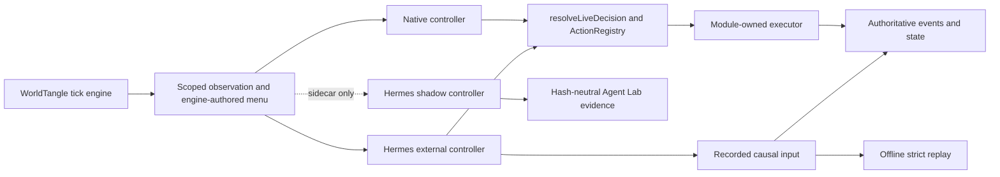

# Phase 12 — Agent Laboratory and Realism Harness

## Status and release boundary

The Phase 12 implementation foundation is present on the Agent Lab feature branch:

- strict shared contracts and optional run-manifest integration;
- deterministic cohort resolution;
- hash-neutral sidecar storage for shadow evidence;
- bounded external action routing through the existing Tier-2 validation and execution path;
- loopback-only REST and Streamable HTTP MCP;
- offline replay from recorded causal inputs;
- isolated Hermes profiles and persistent citizen sessions;
- manifest, artifact, checksum, taint, vector-scorecard, verification, and report tooling; and
- focused contract, shadow-invariance, active-action, and offline-replay gates.

The real-Hermes, three-seed production pilot has **not** been run by ordinary CI.
Until that explicit gate succeeds, Phase 12 is not release-complete and no result
may be presented as evidence of national calibration or real-world prediction.
Riverbend remains a fictional, stylized simulation.

## Authority model

WorldTangle remains the only writer of authoritative world state.



- `native` preserves the existing decision path.
- `shadow` opens the same scoped turn but immediately keeps the native result.
  Shadow turns, submissions, receipts, and tool calls live in sidecar tables
  excluded from the logical state hash.
- `external` waits only until the manifest-pinned deadline. A valid proposal is
  still an ordinary Tier-2 candidate. It must pass exact menu equality,
  capability checks, `resolveLiveDecision`, `ActionRegistry`, and the owning
  module's executor.
- Timeout, malformed output, revocation, or stale tick/projection/menu hashes
  use the existing deterministic Tier-1 fallback.
- Opportunities are prepared and applied in canonical order, independent of
  network completion order.

An accepted external submission emits `agent.external_submission.recorded`.
The trial is marked externally influenced, and the standard Riverbend baseline
probe refuses to treat it as a replacement release baseline. Strict replay
imports and validates the full proposal from that causal input event, then
reconstructs it without consulting the generic LLM cache, Hermes, or the
network.

## Contracts

Simulation creation may include `scenario.agentLab`. Omitting the property
preserves pre-Phase-12 manifests and hashes. The configuration pins:

- protocol, study, trial, and experiment-manifest identities;
- `native`, `shadow`, or `external` mode;
- explicit assignments or `stable_stratified_v1` selection;
- decision deadline and generation/tool budgets;
- driver-policy, prompt-byte, and tool-schema digests; and
- the resolved assignment list in the immutable run manifest.

The strict public schemas are:

- `AgentTurnEnvelope`
- `AgentActionSubmission`
- `AgentActionReceipt`
- `ExperimentManifest`
- `TrialArtifact`
- `ExperimentScorecard`

Unknown fields fail closed. The observation policy exposes only the citizen's
own stable state, facts with event evidence, delivered messages/news, public
prices when available, and cited memories. Operational run identity is not part
of the citizen projection, so source execution and replay hash the same facts.

## Loopback gateway

All Agent Lab routes reject non-loopback clients.

| Method | Path | Purpose |
|---|---|---|
| `GET` | `/api/v1/agent-lab/me` | Return the credential-bound identity and scopes |
| `GET` | `/api/v1/agent-lab/turn?waitMs=N` | Wait for one owned open turn |
| `POST` | `/api/v1/agent-lab/actions` | Submit one idempotent bounded action |
| `GET` | `/api/v1/agent-lab/actions/{submissionId}` | Read one owned receipt |
| `POST` | `/mcp` | Streamable HTTP MCP request endpoint |

The MCP server exposes exactly:

- `wt_identity_get`
- `wt_turn_wait`
- `wt_action_submit`
- `wt_receipt_get`

Each PAT is generated once and bound to study, trial, run, agent, mode, and
scopes. Only its SHA-256 hash is stored. Credentials can be revoked. Database
constraints permit one turn per opportunity and one accepted submission per
turn; an idempotent retry returns its original receipt. Cross-run/cross-agent
lookups, private-data canaries, unknown fields, unrecognized tools, and
unrecognized event types fail closed.

## Harness operation

Generate a manifest only from the clean checkout that will execute it:

```bash
pnpm lab:init -- --out experiments/phase12-pilot.json \
  --study-id phase12-pilot --model <hermes-provider-model> \
  --provider-env <PROVIDER_API_KEY[,PROVIDER_BASE_URL]> \
  --input-microcents-per-token <integer> \
  --output-microcents-per-token <integer> \
  --hermes-executable <absolute-path-if-not-on-PATH>
```

The generator pins the current commit, Node version, lockfile bytes, exact
citizen prompt, exact MCP schemas, driver policy, three seeds, 60 ticks, an
eight-citizen stratified cohort, one native attempt, three shadow attempts, and
three active attempts per seed. Provider prices are explicit integer
microcents-per-token pins; use `0` only for a genuinely free/local provider.
The generator also inspects and pins the Hermes, Python, and OpenAI SDK versions.
`--provider-env` is a comma-separated allowlist of environment-variable names,
never values. The report computes Hermes cost from the API's terminal token
usage and the pinned prices.

Run, verify, and report:

```bash
pnpm lab:run -- --manifest experiments/phase12-pilot.json
pnpm lab:verify -- --artifact artifacts/agent-lab/phase12-pilot/trials/<trial-id>
pnpm lab:report -- --study artifacts/agent-lab/phase12-pilot
pnpm gate:agent-lab
```

`lab:run` refuses a dirty checkout unless `--allow-dirty` is explicitly supplied,
rejects commit/Node/lockfile/Hermes-runtime drift, requires every allowlisted
provider variable to exist, and refuses a nonempty study directory.
`--allow-dirty` is for development only and does not make a trial
release-eligible.

Hermes is driven through its supported API server. The harness creates one
fresh profile, API port, PAT, and persistent session per citizen. It starts one
`/v1/runs` task per open turn, caps the loop at eight iterations, and configures
only the WorldTangle MCP server. Shell, browser, filesystem, delegation, general
resources/prompts, MCP sampling, and other toolsets are disabled. Startup
queries Hermes' API-server toolset inventory and fails closed if any native or
plugin toolset is enabled. The subprocess inherits only basic OS runtime
variables plus the manifest-allowlisted provider variables; unrelated parent
secrets do not cross the profile boundary. Credential files are ephemeral and
excluded from artifacts.

The WorldTangle gateway reserves each MCP call before execution and enforces the
manifest's per-turn tool-call limit. Hermes sets the pinned output-token cap,
records terminal input/output usage, and enforces per-agent daily and whole-run
cost ceilings. Preflight exhaustion revokes the credential and immediately
produces the deterministic fallback; a provider failure or post-call budget
violation disables that controller for later turns and remains visible in the
trial evidence.

The harness stops every Hermes process before requesting strict replay.

## Artifact contract

Each trial preserves:

- canonical manifest and runtime metadata;
- compressed SQLite source database and replay result;
- sanitized turn, submission, receipt, tool-call, and event JSONL;
- event-log, logical-state, LLM-cache, prompt, and artifact hash heads;
- file checksums;
- token, cost, latency, fallback, validity, and tool-call statistics;
- vector scorecard, taint record, and Markdown report.

It never exports PATs, provider/API keys, Hermes API keys, or hidden model
reasoning. Verification fails on missing or extra files, checksum corruption,
manifest drift, nonterminal turns, failed invariants, replay divergence,
unauthorized applied actions, budget violations, taint, secret-shaped content,
or a corrupt database bundle. Manual or unmanifested admin/world-event input
marks the trial tainted; tainted and invalid trials are excluded from
comparative summaries.

## Realism program

The first measurable condition is `partial_observation_v1`. Later changes must
be introduced one condition at a time against the frozen arms:

1. daily commitments and availability;
2. non-binding 7/30-day structured plans;
3. weekly reflection proposals supported by cited memories;
4. numeric inflation, job-security, and business expectations; and
5. relationship-mediated information diffusion.

These are not silently enabled by this foundation. A condition must first add a
manifest pin, deterministic implementation, metric definition, counterfactual
fixture, and report evidence. This protects the distinction between
believability and fitness-for-purpose validity.

See [ODD_AGENT_LAB.md](ODD_AGENT_LAB.md) for the required model-description and
study record.

## Release gate

The real-Hermes pilot is eligible only when all of the following are true:

- exactly three frozen seeds, 60 ticks, and eight stratified citizens;
- per seed: one native, three shadow, and three external attempts;
- every turn has a terminal receipt;
- all active INV-1–10 checks pass;
- no unauthorized proposal applies;
- strict offline replay reports zero divergence;
- no trial included in comparison is tainted or corrupt; and
- the standard repository gates pass.

Required repository commands:

```bash
pnpm typecheck
pnpm lint
pnpm test
pnpm build
pnpm test:e2e
pnpm gate:agent-lab
```

LLM judging, if separately manifested, must be blinded and can never be the
release oracle. Reports retain structural, behavioral, social, economic, and
operational vectors instead of collapsing them into a single realism score.

## Method and implementation references

- [Buzz architecture](https://github.com/block/buzz/blob/main/ARCHITECTURE.md)
- [Buzz Harbor benchmark harness](https://github.com/block/buzz/tree/main/benchmarks/harbor-buzz-orchestra)
- [Hermes architecture](https://github.com/NousResearch/hermes-agent/blob/main/website/docs/developer-guide/architecture.md)
- [Hermes agent loop](https://github.com/NousResearch/hermes-agent/blob/main/website/docs/developer-guide/agent-loop.md)
- [Hermes programmatic integration](https://github.com/NousResearch/hermes-agent/blob/main/website/docs/developer-guide/programmatic-integration.md)
- [Generative Agents](https://arxiv.org/abs/2304.03442)
- [ODD protocol update](https://doi.org/10.18564/jasss.4259)
